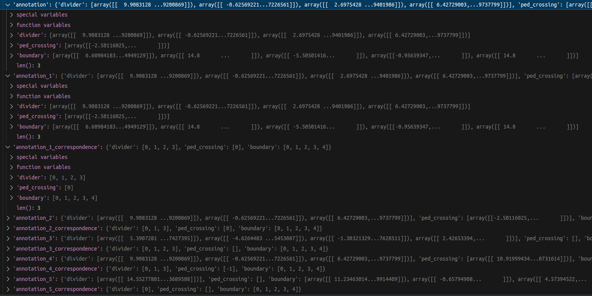
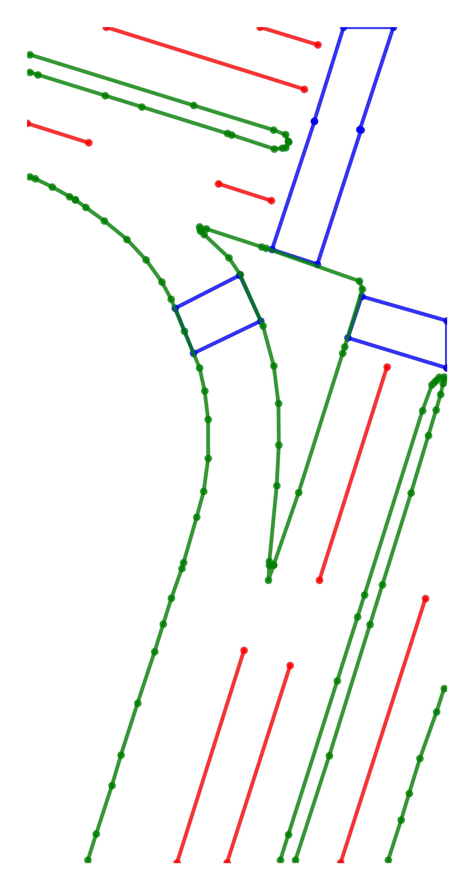

# How to run
The main running file is: custom_nusc_map_converter_copy.py. It is obtained with very few modifications to the custom_nusc_map_converter.py file.

To run it, you need to download the NuScenes V1.0-mini and can_bus data. And modify the following parameters according to local conditions:
```python
parser.add_argument(
    '--root-path',
    type=str,
    default='/home/li/Documents/map/data/sets/nuscenes',
    help='specify the root path of dataset')
parser.add_argument(
    '--canbus',
    type=str,
    default='/home/li/Documents/map/data/sets/nuscenes',
    help='specify the root path of nuScenes canbus')
parser.add_argument(
    '--out-dir',
    type=str,
    default='/home/li/Documents/map/MapTR_local/tools/maptrv2/map_perturbation/output',
    required=False,
    help='name of info pkl')
```

The output will be two .pkl files: nuscenes_map_infos_temporal_train.pkl and nuscenes_map_infos_temporal_val.pkl

more parameters may be needed in future studies:
```python
parser.add_argument(
    '--version',
    type=str,
    default='v1.0',
    required=False,
    help='specify the dataset version, no need for kitti')
```
'--version' the version of nuscenes data. If you want to use other versions of NuScenes data, commit the version = 'v1.0-mini' block and uncommit the upper two blocks: train_version and test_version. And set the version to '--version'
```python
if __name__ == '__main__':
    # train_version = f'{args.version}-trainval'
    # create_nuscenes_infos(
    #     root_path=args.root_path,
    #     out_path=args.out_dir,
    #     can_bus_root_path=args.canbus,
    #     info_prefix=args.extra_tag,
    #     version=train_version,
    #     max_sweeps=args.max_sweeps)

    # test_version = f'{args.version}-test'
    # create_nuscenes_infos(
    #     root_path=args.root_path,
    #     out_path=args.out_dir,
    #     can_bus_root_path=args.canbus,
    #     info_prefix=args.extra_tag,
    #     version=test_version,
    #     max_sweeps=args.max_sweeps)

    version = 'v1.0-mini'
    create_nuscenes_infos(
        root_path=args.root_path,
        out_path=args.out_dir,
        can_bus_root_path=args.canbus,
        info_prefix=args.extra_tag,
        version=version,
        max_sweeps=args.max_sweeps)

```

# How to modify perturbation parameters
Modify it in perturbation.py file.

## Creating perturbation versions
In the function obtain_perturb_vectormap(), by setting the perturbation version name and perturbation parameters, you can create multiple annotation versions to add to info.
```python
    # the first perturbed map
    map_version = 'annotation_1'
    trans_args = PerturbParameters(del_ped=[1, 0.1, None],
                                   shi_ped=[1, 0.1, [5, 5]],
                                   add_ped=[1, 0.1, None])
    info = perturb_map(vector_map, lidar2global_translation,
                       lidar2global_rotation, trans_args, info, map_version, visual)

    # the second perturbed map
    map_version = 'annotation_2'
    trans_args = PerturbParameters(del_div=[1, 0.1, None],
                                   shi_div=[1, 0.1, [5, 5]])
    info = perturb_map(vector_map, lidar2global_translation,
                       lidar2global_rotation, trans_args, info, map_version, visual)
```
The default parameters in the trans_args() class include all perturbation types, and value is a list containing 3 elements

[Boolean: whether to perform this perturbation,

Float: perturbation ratio: 0-1,

Variable type: additional perturbation parameters]

## The result
Each sample in each scene, corresponding to the annotation, has multiple perturbation versions **annotation_\*** and its corresponding list of the original image **annotation_*_correspondence** .


# Visualization
In the perturbation.py file, before the perturbation parameter setting block.

- visual: whether to visualize
- vis_show: whether to display
- vis_path: save path. If not saving side set to None.

```python
trans_args = PerturbParameters(
    visual=True, vis_show=False, vis_path='/home/li/Documents/map/MapTRV2Local/tools/maptrv2/map_perturbation/visual')
visual = RenderMap(info, vector_map, trans_args)
```

